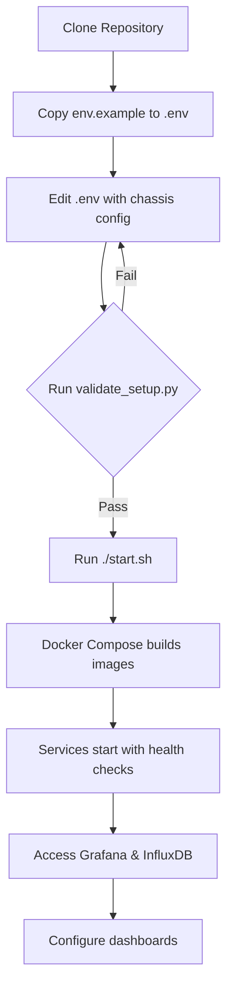

# Docker Deployment Files Summary

## 📦 Files Created for Self-Contained Docker Deployment

### Core Docker Files

1. **`Dockerfile`**
   - Python 3.11-slim based image
   - Installs all dependencies
   - Runs as non-root user for security
   - Health checks included
   - Entry point: `portInfoPoller.py`

2. **`docker-compose.yml`**
   - 3 services: InfluxDB, Grafana, IxOS Poller
   - Auto-configured networking
   - Persistent volumes
   - Health checks for all services
   - Environment variable support
   - Service dependencies configured

3. **`.dockerignore`**
   - Optimizes Docker build context
   - Excludes unnecessary files from image

4. **`.gitignore`**
   - Prevents committing sensitive data
   - Excludes .env files, logs, cache

### Configuration Files

5. **`env.example`**
   - Template for environment variables
   - Documents all configuration options
   - Safe to commit (no secrets)
   - Users copy to `.env` and customize

6. **`config.py`** (Updated)
   - Now supports environment variables
   - Falls back to code configuration
   - Works both in Docker and standalone
   - Auto-validation of configuration

### Grafana Provisioning

7. **`grafana/provisioning/datasources/influxdb.yml`**
   - Auto-configures InfluxDB data source
   - No manual setup required in Grafana
   - Uses environment variables for token

### Startup Scripts

8. **`start.sh`**
   - One-command deployment script
   - Checks prerequisites
   - Creates .env if missing
   - Pulls images and builds containers
   - Shows service status and access URLs
   - Colored output for better UX

9. **`stop.sh`**
   - Graceful shutdown script
   - Optional volume removal with warning
   - Confirmation for destructive operations

10. **`validate_setup.py`**
    - Pre-flight checks before deployment
    - Validates Docker installation
    - Checks .env configuration
    - Verifies required files
    - Tests port availability
    - Comprehensive status reporting

### Documentation

11. **`DOCKER_DEPLOYMENT.md`**
    - Complete Docker deployment guide
    - Quick start instructions
    - Advanced configuration
    - Production deployment tips
    - Backup and restore procedures
    - Troubleshooting section
    - Security considerations
    - Performance tuning

12. **`QUICK_START.md`**
    - 5-minute getting started guide
    - Minimal steps to get running
    - Common commands reference
    - Quick troubleshooting

13. **`README.md`** (Updated)
    - Added Docker deployment section
    - Updated table of contents
    - New changelog with v3.0
    - Docker-first approach highlighted

### Utility Scripts

14. **`check_influxdb_retention.py`** (Already existed)
    - Checks InfluxDB retention policy
    - Useful for debugging data purging

15. **`requirements.txt`** (Updated)
    - Added version constraints
    - Includes all required packages

## 🏗️ Project Structure

```
IxPortUtilizationPlotter/
├── Docker Core
│   ├── Dockerfile                          ✅ NEW
│   ├── docker-compose.yml                  ✅ NEW
│   ├── .dockerignore                       ✅ NEW
│   └── .gitignore                          ✅ NEW
│
├── Configuration
│   ├── env.example                         ✅ NEW
│   └── config.py                           🔄 UPDATED
│
├── Application Code
│   ├── portInfoPoller.py                   🔄 UPDATED (fixed deletion)
│   ├── influxDBclient.py
│   ├── IxOSRestAPICaller.py
│   └── RestApi/
│       ├── IxOSRestInterface.py
│       └── requirements.txt
│
├── Scripts
│   ├── start.sh                            ✅ NEW
│   ├── stop.sh                             ✅ NEW
│   ├── validate_setup.py                   ✅ NEW
│   └── check_influxdb_retention.py
│
├── Grafana
│   └── provisioning/
│       └── datasources/
│           └── influxdb.yml                ✅ NEW
│
├── Documentation
│   ├── README.md                           🔄 UPDATED
│   ├── DOCKER_DEPLOYMENT.md                ✅ NEW
│   ├── QUICK_START.md                      ✅ NEW
│   └── DOCKER_FILES_SUMMARY.md             ✅ NEW (this file)
│
└── Other
    ├── requirements.txt                    🔄 UPDATED
    └── images/                             (existing screenshots)
```

## 🚀 Deployment Workflow



## 🔑 Key Features

### 1. One-Command Deployment
```bash
./start.sh
```

### 2. Auto-Configuration
- InfluxDB bucket and org auto-created
- Grafana data source pre-configured
- No manual setup required

### 3. Environment-Based Config
- All settings in `.env` file
- Easy to customize per environment
- Secrets not hardcoded

### 4. Persistent Data
- Volumes survive container restarts
- Historical data preserved
- Configuration persisted

### 5. Health Monitoring
- Built-in health checks
- Automatic service dependency management
- Graceful startup and shutdown

### 6. Production-Ready
- Non-root user in containers
- Resource limits configurable
- Security best practices
- Backup procedures documented

## 📝 Configuration Example

**`.env` file:**
```bash
# InfluxDB
INFLUXDB_TOKEN=my-secret-token-12345
INFLUXDB_ORG=keysight
INFLUXDB_BUCKET=ixosChassisStatistics

# Grafana
GRAFANA_ADMIN_PASSWORD=secure-password

# Chassis (JSON array on ONE line)
CHASSIS_LIST=[{"ip":"10.36.75.205","username":"admin","password":"admin"},{"ip":"10.36.75.206","username":"admin","password":"admin"}]

# Polling
POLLING_INTERVAL=10
```

## 🎯 User Experience

### Before (Manual Setup)
1. Install InfluxDB
2. Configure InfluxDB
3. Create bucket and org
4. Generate API token
5. Install Grafana
6. Configure data source
7. Install Python dependencies
8. Configure application
9. Start application
10. Create dashboards

**Time: 30-60 minutes** ⏰

### After (Docker Setup)
1. Copy `env.example` to `.env`
2. Edit chassis list
3. Run `./start.sh`
4. Open Grafana
5. Create dashboard

**Time: 5 minutes** ⚡

## 📊 Services Overview

| Service | Port | Purpose | Auto-Configured |
|---------|------|---------|-----------------|
| InfluxDB | 8086 | Time-series DB | ✅ Yes |
| Grafana | 3000 | Visualization | ✅ Yes |
| IxOS Poller | - | Data collection | ✅ Yes |

## 🔒 Security Features

- Non-root container user
- Environment-based secrets
- No hardcoded passwords
- .gitignore prevents secret commits
- Isolated Docker network
- Optional secret management support

## 📈 Benefits

✅ **Faster deployment** - 5 minutes vs 30-60 minutes  
✅ **Reproducible** - Same setup everywhere  
✅ **Isolated** - No conflicts with host system  
✅ **Portable** - Run anywhere Docker runs  
✅ **Version controlled** - Infrastructure as code  
✅ **Easy updates** - `docker compose pull && docker compose up -d`  
✅ **Easy rollback** - Tag and version Docker images  
✅ **Development friendly** - Same setup for dev and prod  

## 🎓 Learning Resources

- **Quick Start:** `QUICK_START.md`
- **Full Docker Guide:** `DOCKER_DEPLOYMENT.md`
- **Application Guide:** `README.md`
- **Validation:** `python3 validate_setup.py`

## ✅ Testing Checklist

- [ ] Docker and Docker Compose installed
- [ ] `.env` file created and configured
- [ ] `validate_setup.py` passes all checks
- [ ] `./start.sh` completes successfully
- [ ] All services show "Up (healthy)" status
- [ ] Grafana accessible at http://localhost:3000
- [ ] InfluxDB accessible at http://localhost:8086
- [ ] Poller logs show successful polling
- [ ] Data visible in InfluxDB
- [ ] Dashboard shows port states

## 🚀 Next Steps for Users

1. **Deploy:** Run `./start.sh`
2. **Verify:** Check logs with `docker compose logs -f`
3. **Access:** Open Grafana at http://localhost:3000
4. **Configure:** Create dashboards
5. **Monitor:** Watch real-time port utilization
6. **Customize:** Add more chassis, adjust intervals
7. **Production:** Review security in `DOCKER_DEPLOYMENT.md`

---

**The project is now a complete, self-contained Docker package! 🐳📦✨**

